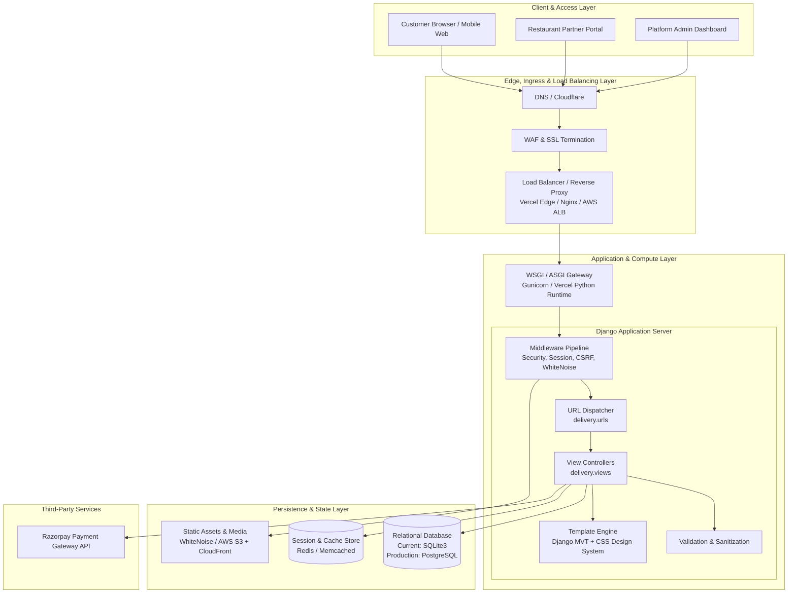
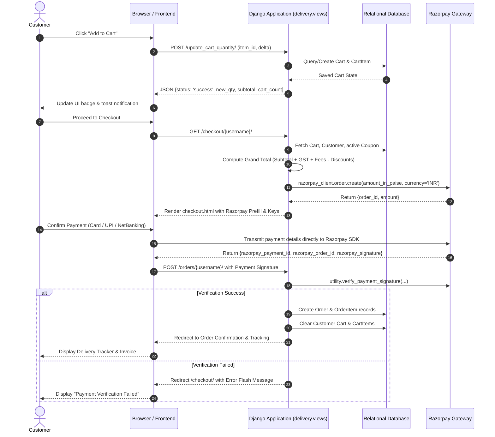

# YumYatra - System Architecture & Engineering Documentation

## 1. Executive Summary

**YumYatra** is an end-to-end multi-tenant food delivery and restaurant management platform built on Python and Django. The platform bridges three distinct user groups:
1. **Customers**: Discover restaurants, browse menus, manage dynamic carts, apply promotional coupons, and execute digital payments via Razorpay.
2. **Restaurant Partners**: Manage restaurant profiles, menu items, pricing, item availability, and incoming kitchen orders.
3. **Platform Administrators**: Supervise onboarding, monitor real-time financial metrics (Gross Order Value, commissions, platform profits), and track daily deliveries.

This document details the system topology, end-to-end operational workflows, load balancing and maintainability architecture, concurrency conflicts, failure modes, and mitigation strategies.

---

## 2. High-Level System Architecture



---

## 3. Core Architectural Layers

### 3.1 Presentation & UI Layer
* **Architecture**: Server-Side Rendered (SSR) Model-View-Template (MVT) pattern.
* **Styling**: Tailored design system (`premium.css`) featuring responsive layouts, CSS custom properties, glassmorphism, and subtle micro-animations.
* **Client-Side Logic**: Native JavaScript for asynchronous cart updates, quantity increments, coupon redemption, dynamic tab switching, and Razorpay checkout triggers without full-page reloads.

### 3.2 Ingress & Load Balancing Layer
* **Current Deployment (Vercel Serverless)**:
  * Traffic enters via Vercel's global Anycast Edge Network.
  * Ingress routing is declared in `vercel.json`, routing all requests (`/(.*)`) to the WSGI bridge `api/index.py`.
  * Requests scale horizontally by instantiating serverless worker containers on demand.
* **Traditional Production Blueprint (VM / Containerized)**:
  * **Layer 7 Load Balancer (Nginx / AWS Application Load Balancer)**:
    * SSL/TLS Termination.
    * Reverse proxying with health checks (`/healthz` or root heartbeat).
    * Least-Connections or Round-Robin load distribution across multiple Gunicorn workers.
    * Static asset offloading to prevent application server saturation.

### 3.3 Application & Business Logic Layer
* **Runtime**: Python 3.12+ / Django 5+.
* **Module Structure**:
  * **`delivery` App**: Contains all domain models (`Customer`, `Restaurant`, `Item`, `Cart`, `CartItem`, `Order`, `OrderItem`, `Coupon`), business views, authentication hooks, and financial calculations.
  * **URL Router** (`delivery/urls.py`): Explicit routing for customer, partner, and admin endpoints.
  * **Business Engines**:
    * **Pricing Engine**: Computes subtotal, dynamic delivery fees (free delivery above ₹500 threshold, otherwise ₹35), packaging/handling fees (₹15), service fees (₹10), GST (5%), and percentage/flat coupon discounts.
    * **Commission Engine**: Automatically deducts 10% platform commission from restaurant payouts and allocates the ₹10 flat service fee to platform revenue.

### 3.4 Data & Persistence Layer
* **Current Storage**: File-based SQLite (`db.sqlite3`). Automatically bootstrapped and seeded with `initial_data.json` on cold start.
* **Production Storage (Target)**: Managed PostgreSQL instance (e.g., AWS RDS, Supabase, Neon) with connection pooling (PgBouncer) for horizontal scalability.

---

## 4. End-to-End Workflows & Data Flows

### 4.1 Customer Order & Payment Sequence



### 4.2 Partner Menu & Restaurant Management
1. **Partner Authentication**: Restaurant signs in via role-based credentials.
2. **Menu Management**: Partner adds or modifies menu items (`name`, `price`, `description`, `picture`, `category`).
3. **Live Availability**: Updates immediately reflect across all customer restaurant listings without requiring cache purge.

### 4.3 Admin Analytics & Platform Accounting
1. Aggregates all orders recorded within the selected timeframe.
2. Evaluates Gross Order Value (GOV):
   $$\text{GOV} = \sum (\text{Order Grand Totals})$$
3. Computes Platform Net Earnings:
   $$\text{Platform Earnings} = \sum (0.10 \times \text{Item Subtotal}) + (\text{Total Orders} \times ₹10)$$
4. Groups breakdown by individual restaurant partner to verify sales and commission payables.

---

## 5. Architectural Quality Attributes

| Quality Attribute | Implementation in YumYatra | Enterprise Production Target |
| :--- | :--- | :--- |
| **Load Balancing** | Handled transparently by Vercel Anycast edge distribution and serverless container scaling. | Nginx / AWS ALB with Round-Robin / Least Connections + AWS Auto-Scaling Group. |
| **Maintainability** | Clean Django MVT structure; decoupled styling in `premium.css`; fixture seeding (`initial_data.json`). | Containerized Docker microservices, CI/CD automated linting (flake8/black), and pytest coverage. |
| **Data Integrity** | Foreign key constraints (`models.CASCADE`), decimal/float sanitization, and automated Django migrations. | PostgreSQL ACID transactions with `select_for_update()` row locking. |
| **Security** | CSRF middleware verification, sanitized query execution via Django ORM (SQL injection immune), Razorpay HMAC SHA256 signature verification. | HTTPS HSTS enforcement, encrypted secrets manager (AWS Secrets Manager / Vault), Redis rate limiting. |
| **Observability** | Standard Python logging, Django console debug logs, and serverless runtime exception tracing. | OpenTelemetry / Sentry for error tracking, Prometheus + Grafana for APM metrics. |

---

## 6. System Conflicts, Race Conditions & Failure Modes

When operating a distributed food delivery system, multiple concurrency and data synchronization conflicts can emerge. Below is an analysis of potential conflicts and how the system handles or mitigates each.

### 6.1 Database Write Contention & Concurrency Locks
* **The Conflict**: SQLite relies on database-level file locks for write transactions (`BEGIN IMMEDIATE`). When multiple concurrent users attempt to place orders, modify carts, or register accounts simultaneously, one transaction blocks all others, causing `OperationalError: database is locked`.
* **Resolution / Mitigation**:
  * For local and single-instance deployments, transactions execute sequentially with short lock timeouts.
  * For multi-user production scale: **Migrate from SQLite to PostgreSQL**. PostgreSQL uses Multi-Version Concurrency Control (MVCC) and row-level locking, enabling thousands of simultaneous non-conflicting reads and writes.

### 6.2 Cart State Drift & Inventory Race Conditions
* **The Conflict**: A customer adds an item priced at ₹250 to their cart. Before checkout is completed:
  1. The restaurant partner updates the item price to ₹300, or
  2. The item is marked unavailable or removed from the menu.
  If the cart does not re-validate against the live database, the customer is billed for an outdated price.
* **Resolution / Mitigation**:
  * **Dynamic Price Evaluation**: The checkout view recalculates the order total directly from the database `item.price` at the moment checkout is loaded and when payment verification executes, rather than trusting client-submitted values.
  * **Defensive Deletion Handling**: Cart items reference menu items via `models.CASCADE`, ensuring deleted items automatically disappear from pending carts.

### 6.3 Payment vs. Order State Desynchronization (Split-Brain)
* **The Conflict**: The customer pays successfully on Razorpay, but before Razorpay can redirect the user back to the YumYatra server:
  * The user's internet disconnects,
  * The browser window is abruptly closed, or
  * A network timeout occurs between the client and YumYatra.
  * **Result**: Money was deducted from the customer's account, but no order record was generated in the database.
* **Resolution / Mitigation**:
  * **Client-Side Signature Verification**: When the browser completes payment, the Razorpay handler submits `razorpay_payment_id`, `razorpay_order_id`, and `razorpay_signature` to `/orders/` for cryptographic HMAC verification before order creation.
  * **Production Webhook Listener (Idempotency)**: Implement a server-to-server Razorpay Webhook endpoint (`/api/webhooks/razorpay/`). Razorpay sends guaranteed server-side notifications (`order.paid`). The webhook checks if the order exists; if not, it generates the order asynchronously and logs the transaction, guaranteeing zero lost orders regardless of browser state.

### 6.4 Multi-Restaurant Cart Split Conflicts
* **The Conflict**: A customer adds dishes from "Italian Bistro" and "Spicy Hub" into the same cart. When placing the order, how are delivery fees, restaurant payouts, and delivery drivers assigned?
* **Resolution / Mitigation**:
  * **Order-Item Separation**: The data model separates `Order` (customer-level billing) and `OrderItem` (individual items linked to their respective restaurants).
  * **Single-Restaurant Cart Enforcement (Recommended Option)**: If multi-restaurant delivery is not supported by logistics, cart insertion triggers an alert: *"You have items from another restaurant in your cart. Would you like to clear your cart and start a new order?"*

### 6.5 Session Drift Behind Multiple Load-Balanced Instances
* **The Conflict**: When deploying multiple Django application instances behind a round-robin load balancer without sticky sessions, if sessions are stored on local disks (`django.contrib.sessions.backends.file`), Request 1 might authenticate on Server A, but Request 2 routes to Server B, where the user appears logged out.
* **Resolution / Mitigation**:
  * **Stateless Application Servers**: Django is configured to store sessions in the centralized database (`django.contrib.sessions.backends.db`) or in a shared in-memory **Redis** cache (`django.contrib.sessions.backends.cache`).
  * Every server node behind the load balancer reads from the identical shared session store, eliminating session drift.

---

## 7. Recommended Production Deployment Blueprint

```
                     [ Internet Traffic ]
                              │
                              ▼
                     [ Cloudflare / WAF ]
                              │
                              ▼
             [ Nginx / AWS Application Load Balancer ]
             (SSL Termination, Rate Limiting, Health Checks)
                      │               │
         ┌────────────┴───────────────┴────────────┐
         ▼                                         ▼
[ Gunicorn Worker 1 ]                     [ Gunicorn Worker 2 ]
(Django Application)                      (Django Application)
         │                                         │
         └────────────────────┬────────────────────┘
                              │
       ┌──────────────────────┼──────────────────────┐
       ▼                      ▼                      ▼
[ PostgreSQL DB ]      [ Redis Cluster ]      [ AWS S3 / CDN ]
(ACID Transactions,   (Sessions, Caching,     (Static Assets &
 MVCC Row Locking)     Celery Job Queue)       Restaurant Photos)
```

### Steps to Implement Production Hardening:
1. **Database**: Switch `settings.py` `DATABASES` configuration from `sqlite3` to `django.db.backends.postgresql`.
2. **Session & Cache**: Configure `django-redis` for distributed session and cache management.
3. **Background Tasks**: Introduce **Celery + Redis** for asynchronous operations (sending order notification emails/SMS, generating PDF invoices, webhook ingestion).
4. **Load Balancer**: Deploy an Nginx reverse proxy with upstream definitions pointing to the Gunicorn socket pool with automated health probes.
